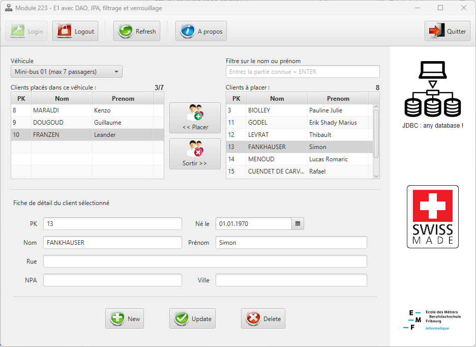
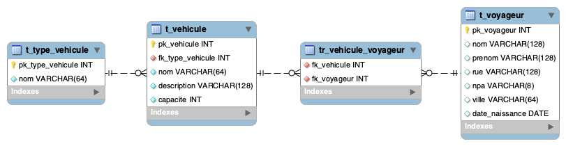
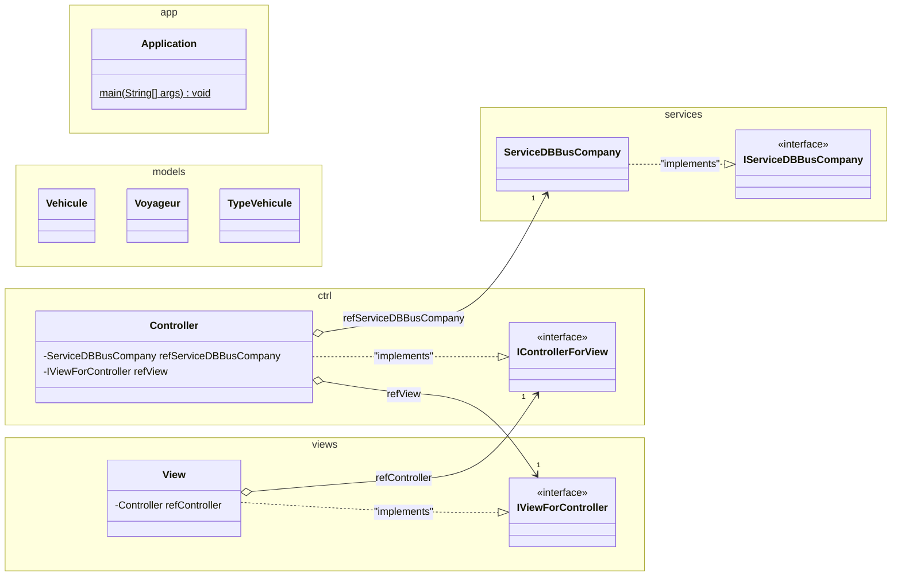
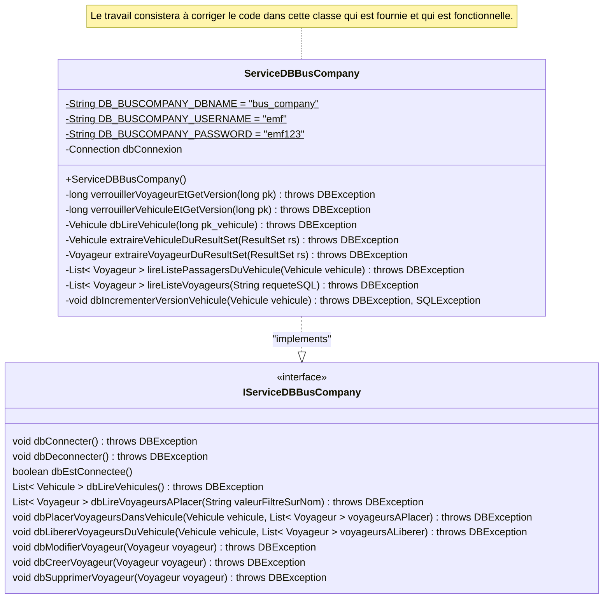

# Exercice JDBC BusCompany

## Objectifs

- Finir de s'approprier de cette technologie JDBC avec un cas réel plus complexe.
- Appliquer les connaissances reçues afin de rendre ce logiciel **"multi-utilisateurs safe"**.

## Vue de l'application concernée

## Préalable

Démarrez votre instance `MySQL` et `phpmyadmin` dans Docker à l'aide du fichier `docker-compose.yml` fourni.

Pour faire cela, commencez par lancer `Docker Desktop` sur votre poste de travail puis, dans VSC, sélectionnez le fichier [docker-compose.yml](docker-compose.yml) de votre projet VSC. Faites ensuite un clic-droit sur celui-ci et sélectionnez l'option `compose up`.

Une fois les instances `MySQL` et `phpmyadmin` démarrées, vous pourrez accéder à `phpmyadmin` depuis Docker Desktop en cliquant sur le lien [http://localhost:8080](http://localhost:8080).

Avec son aide, importez ensuite le script [/mysql/schema/crud_personnes.sql](/mysql/schema/schema.sql) afin que la base de données de `bus_company` ci-dessous y soit créée. Elle contiendra les table suivantes :

**Schéma de la BD**

.

## Vue d'ensemble UML

### Diagramme UML des classes de l'application

Il s'agit d'une application MVC classique.

### Diagramme de la classe `ServiceDBBusCompany`

## Travail à réaliser

- Lisez avec attention cette consigne
- Suivez avec attention la démonstration que votre professeur va vous faire, de manière à vous imprégner du fonctionnement de cette application et bien le comprendre.
- Prenez connaissance des classes déjà fournies et leur code
- Appropriez-vous du code fourni et faites l'effort de le comprendre, en particulier celui du service `ServiceDBBusCompany`.
- Corrigez et complétez le code des méthodes de ce service `ServiceDBBusCompany` afin que les use-cases multi-utilisateurs ci-dessous soient corrigés et fonctionnels :
  - Deux instances de l'application essaient de mettre à jour un même voyageur.
  - Deux instances de l'application essaient de (trop) remplir un même véhicule.
  - Une instance de l'application essaie de remplir ou vider un véhicule qu'une autre instance vient de supprimer.
- **Quelles ressources faudrait-il verrouiller** pour éviter ces problèmes ?
- **Quelles vérifications faudrait-il faire** pour garantir ces situations ?
- Faites du pas-par-pas avec le débogueur et vérifiez bien que tous les cas de figure soient fonctionnels, sans générer d'erreurs ni d'exceptions

---

